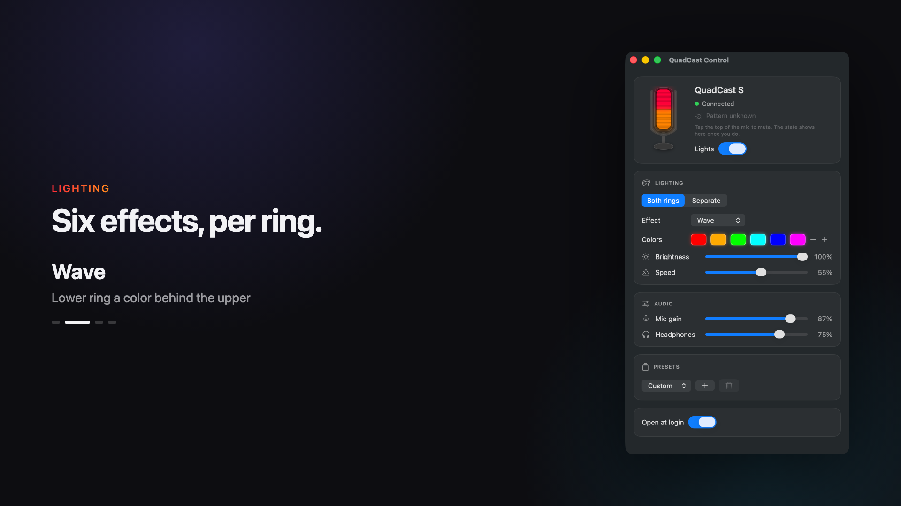
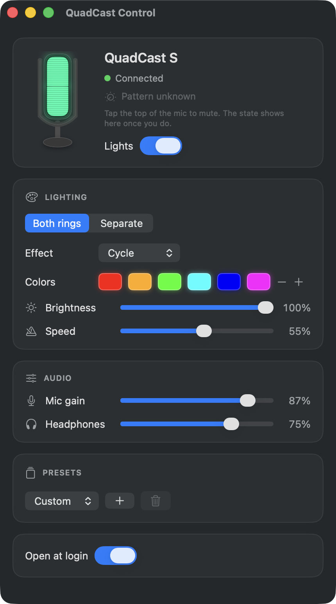

<p align="center">
  
</p>

A small native macOS app (menu bar + controls window) for the HyperX QuadCast S, covering what NGENUITY does on Windows: lighting effects per ring, brightness, speed, presets, plus software mic gain and headphone volume.

## Demo

A 37-second narrated walkthrough, in two cuts:

- [Widescreen, 1920x1080](docs/quadcast-control-wide.mp4)
- [Vertical, 1080x1920](docs/quadcast-control-vertical.mp4) — for phone-shaped places

[](docs/quadcast-control-wide.mp4)



## What it does

The lighting section offers Solid, Blink, Cycle, Wave, Lightning, Pulse and Off, with up to 8 colors, brightness and speed. Both rings can share one effect or be set separately. Presets are saved locally and picked from a dropdown.

The window shows the mic drawn as it looks, lit with the colors it shows, on the same clock as the hardware. It animates while an animated effect is selected and the app is frontmost. The window is resizable.

Colors are chosen in a popover attached to the swatch, with hue, saturation and brightness bars. That replaces the system color panel, which is a separate floating window that tends to reopen on whichever display you last used it on.

The window also shows what the mic's own controls are set to: whether the tap sensor has it muted, and which pickup pattern the dial on the back has selected, drawn as the same shape the dial is marked with. Both are readouts; neither can be set from software.

Clicking the menu bar icon opens a panel with the status, a lights switch, the mic gain and headphone sliders, and the presets dropdown, so the usual adjustments don't need the window at all.

The audio section sets the mic's input level and headphone-jack volume through macOS's audio system (the same values as System Settings › Sound). If macOS doesn't expose a software volume for the device, the app says so and the hardware gain dial is the way to go.

---

The sections below use [ASD-STE100 Simplified Technical English](https://www.asd-ste100.org/).

## Requirements

You must have macOS 13 Ventura or a later version.

You must also have the Xcode Command Line Tools. To install the tools, run `xcode-select --install`. You do not need the full Xcode application.

## Build and run

To build the application, run these commands:

```bash
chmod +x build.sh
./build.sh            # makes build/QuadCast Control.app
./build.sh --install  # makes the application, then copies it to /Applications
```

Install the application in /Applications. If you install it in a different location, the "Open at login" function can be unreliable.

The repository contains the application icon at `Resources/AppIcon.icns`. The script `Tools/make-icon.swift` draws the icon. To change the icon, edit the script and then run `swift Tools/make-icon.swift`.

The script `Tools/make-banner.swift` draws the banner at the top of this page. The script reads the icon file. Run the script again after you change the icon.

## How it operates

The QuadCast S does not store the lighting data. Thus the computer must send the colors continuously, approximately 18 times each second. This is the reason that the application stays in the menu bar. If you stop the application, the microphone shows its internal rainbow effect again. The hardware operates in the same way on Windows.

The application sends the colors as USB control transfers. macOS does not install a driver on the lighting interface. Thus macOS does not make an IOHIDDevice for that interface, and IOHIDManager cannot find it.

macOS makes HID devices for the mute control and the volume control only. These two devices do not accept a report of 64 bytes. The application keeps the lighting interface while it operates, and no other process can use the interface at the same time.

### The controls on the microphone

The microphone has two controls of its own. You cannot set these controls from software, but the microphone reports their positions.

The two controls use a vendor-defined HID interface (usage page 0xFFFF). macOS does not protect this interface with the Input Monitoring permission. Thus the application needs no permission, and macOS shows no prompt.

The microphone sends a report of 8 bytes with the ID 5. Byte 1 identifies the control. Byte 2 gives the new value.

| report | meaning |
| --- | --- |
| `05 10 00` | mute sensor: muted |
| `05 10 01` | mute sensor: not muted |
| `05 11 00` to `05 11 03` | pattern dial: bidirectional, cardioid, omnidirectional, stereo |

The values of the dial are in the opposite sequence to the icons on the dial. The icons show stereo, omnidirectional, cardioid, and bidirectional from left to right.

The microphone does not answer a request for its current state. Thus the application does not know the two positions at start. The status shows "Connected" until you touch the mute sensor. After that, the status shows "Live" or "Muted". The pattern shows "Pattern unknown" until you turn the dial.

When you mute the microphone, the firmware also switches the rings off. Thus the hardware also shows the mute state.

The gain dial is analog and sends no data. Thus the application cannot show its position. The "Mic gain" slider sets the macOS input level, which is a different control.

The application uses approximately 0.3% of the CPU when it is idle.

## Troubleshooting

### The application shows "QuadCast S not found", but the microphone is connected

To show the USB IDs, run this command:

```bash
ioreg -p IOUSB -l -w 0 | grep -E '"(USB Product Name|idVendor|idProduct)"'
```

The command shows the numbers in decimal. The application knows the ID 0951:171F. It also knows the HP IDs 03F0:0F8B, 028C, 048C, 068C, and 098C. If your microphone has a different ID, add the ID to `supportedIDs` in `QuadCastDevice.swift`.

A QuadCast S makes two USB devices, and the two devices have the same name. One device is for audio, and one device is for lighting. The application uses the lighting device.

On the test unit, the lighting device is 03F0:028C and the audio device is 03F0:0294. To identify the two devices, run `ioreg -r -n "HyperX QuadCast S" -l -w 0`. The lighting device has an `IOUSBHostInterface@0` with no driver below it.

### Make sure that the application has the microphone

While the application operates, run this command:

```bash
ioreg -r -n "HyperX QuadCast S" -l -w 0 | grep AppleUSBHostInterfaceUserClient
```

The result must show `QuadCastControl`. If the result shows a different process, that process holds the lighting interface. The application stays disconnected until that process stops.

### A different application controls the lights

Stop all other RGB applications, for example OpenRGB or the `quadcastrgb` command. Two applications cannot control the lights at the same time.

### macOS does not let you open the application

Hold the Control key, click the application, and then select Open. You do this one time only.

## License

This software uses the MIT license. Refer to [LICENSE](LICENSE).

## Credits

The QuadcastRGB project recorded the USB lighting protocol (github.com/Ors1mer/QuadcastRGB, GPL-2.0). This application is an independent implementation in Swift. It contains no code from that project.
